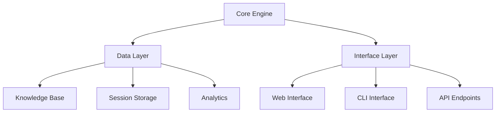
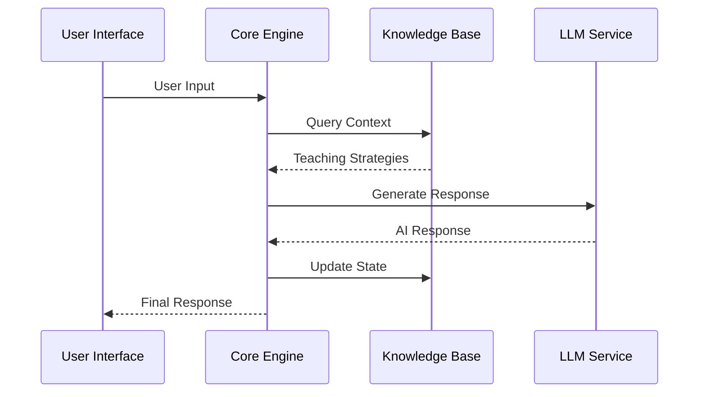

# UTTA System Architecture

## System Overview
The UTTA system is designed as a modular, extensible platform for AI-powered teacher training. This guide covers the system's architecture and component interactions.

### High-Level Architecture



#### Core Engine
- LLM Integration
- State Management
- Event Processing

#### Data Layer
- Knowledge Base
- Session Storage
- Analytics

#### Interface Layer
- Web Interface
- CLI Interface
- API Endpoints

## Core Components

### Teacher Training Agent
- Scenario generation and management
- Component coordination
- Progress tracking
- Session management

### Knowledge Manager
- Teaching strategy storage
- Content processing
- Contextual recommendations
- Resource management

### Language Processor
- Response analysis
- Student simulation
- Performance evaluation
- Feedback generation

## Data Flow

### Process Flow
```
1. User Input
   ↓
2. Interface Layer Processing
   ↓
3. Core Engine
   ├→ LLM Processing
   ├→ State Updates
   └→ Event Generation
   ↓
4. Knowledge Base Integration
   ↓
5. Response Generation
   ↓
6. User Interface Update
```

### State Management

#### State Types
- **Session State:** Current interaction context
- **User State:** Learning progress and preferences
- **System State:** Resource allocation and performance

## Integration Points

### Component Interfaces
- Event-driven communication
- RESTful API endpoints
- WebSocket connections
- Message queues

### Extension Guidelines
- Use standard interfaces for component communication
- Implement proper error handling
- Follow event-driven architecture patterns
- Maintain loose coupling between components
- Document all integration points

## System Interactions

### Component Communication


### Data Processing Pipeline
1. Input Validation
2. Context Enrichment
3. Knowledge Integration
4. Response Generation
5. State Updates
6. Output Formatting

## Deployment Architecture

### Infrastructure Components
- Application Servers
- Database Clusters
- LLM Service
- Load Balancers
- Monitoring Systems

### Scaling Considerations
- Horizontal scaling for web servers
- Vertical scaling for LLM processing
- Distributed knowledge base
- Caching layers
- Load distribution 