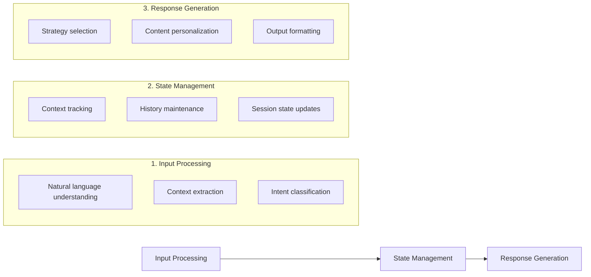

# Building Educational Chatbots with LLMs

This guide covers the essential components and best practices for building educational chatbots using modern LLM architectures, with a focus on creating engaging and effective learning experiences.

## Interaction Flow



## Conversation Lifecycle

### Session Phases

1. **Initialization**
   - Load teacher profile
   - Initialize conversation state
   - Set up tracking metrics

2. **Active Interaction**
   - Process teacher inputs
   - Generate student responses
   - Track engagement levels

3. **Progress Monitoring**
   - Evaluate teaching effectiveness
   - Adjust difficulty levels
   - Provide real-time feedback

4. **Session Completion**
   - Generate session summary
   - Save progress data
   - Provide improvement suggestions

## Conversation Management

### Context Management
```python
# src/interfaces/chat.py
class ConversationContext:
    def __init__(self):
        self.history = []
        self.current_topic = None
        self.student_state = StudentState()
        self.teaching_goals = TeachingGoals()

    def update(self, message: Message):
        """Update conversation context with new message."""
        self.history.append(message)
        self._update_topic(message)
        self._update_student_state(message)
        self._check_teaching_goals(message)

    def get_relevant_context(self, window_size: int = 5):
        """Get recent context for response generation."""
        return {
            'history': self.history[-window_size:],
            'topic': self.current_topic,
            'student_state': self.student_state.current,
            'goals': self.teaching_goals.pending
        }
```

### Memory Systems

| Type | Purpose | Implementation |
|------|---------|----------------|
| Short-term | Current conversation state | In-memory queue with size limit |
| Working | Active learning objectives | Priority queue with decay |
| Long-term | Student profile & history | Persistent storage with indexing |

### Conversation Flow
```python
# src/utils/simulator_session.py
class DialogManager:
    def __init__(self):
        self.context = ConversationContext()
        self.history = []
        
    def get_context(self):
        """Get current conversation context."""
        return self.context.current_state()
        
    def update(self, user_input, response):
        """Update conversation state with new interaction."""
        self.history.append({
            'user': user_input,
            'system': response,
            'timestamp': time.time()
        })
        self.context.update(user_input, response)
```

## Educational Features

### Response Personalization

#### Adaptation Factors
- **Learning Style:** Visual, auditory, or kinesthetic preferences
- **Proficiency Level:** Current understanding and skills
- **Engagement Pattern:** Response to different teaching approaches
- **Progress Rate:** Speed of concept mastery

### Progress Assessment

#### Evaluation Metrics
- **Teaching Effectiveness:** Impact of strategies used
- **Student Engagement:** Level of participation and interest
- **Learning Progress:** Mastery of concepts and skills
- **Behavioral Changes:** Improvements in teaching approach

### Feedback Systems

#### Feedback Types
- **Immediate:** Real-time response validation
- **Analytical:** Detailed strategy assessment
- **Constructive:** Improvement suggestions
- **Summative:** Session overview and progress

## Implementation

### Basic Setup
```python
# src/interfaces/chat.py
class EducationalChatbot:
    def __init__(self):
        self.dialog_manager = DialogManager()
        self.state_tracker = StateTracker()
        self.response_generator = ResponseGenerator()
        
    def process_input(self, user_input):
        # Update conversation state
        context = self.dialog_manager.get_context()
        state = self.state_tracker.update(user_input)
        
        # Generate appropriate response
        response = self.response_generator.generate(
            input=user_input,
            context=context,
            state=state
        )
        
        # Update conversation history
        self.dialog_manager.update(user_input, response)
        return response
```

### Best Practices

#### Implementation Guidelines
- Maintain consistent teaching persona
- Implement proper error handling
- Monitor conversation quality
- Provide clear learning objectives
- Include progress assessments 