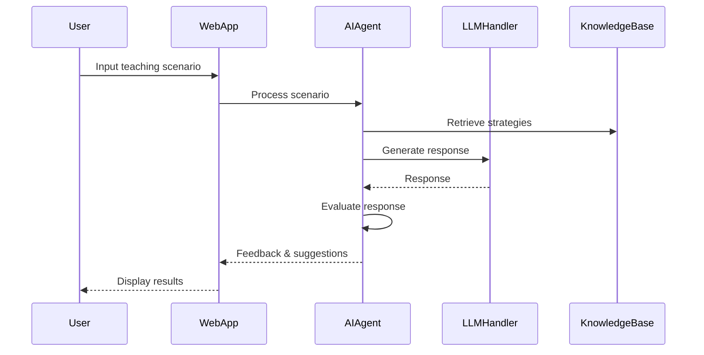

# UTTA (Universal Teacher Training Assistant)

## 🎯 Overview
UTTA is an AI-powered educational simulation chatbot designed to help train teachers through realistic classroom scenarios. It provides interactive simulations, immediate feedback, and personalized teaching strategies to enhance educational practices.

## 🌟 Key Features
- Interactive teaching scenarios
- Real-time feedback and evaluation
- Personalized teaching strategies
- Behavioral management simulations
- Student engagement techniques
- Differentiated learning approaches

## 📁 Project Structure
```
UTTA/
├── web_app.py           # Streamlit web interface
├── ai_agent.py          # Core AI agent implementation
├── llm_handler.py       # Language model processing
├── llm_interface.py     # LLM communication interface
├── knowledge_base.py    # Teaching strategies and characteristics
├── evaluator.py         # Response evaluation module
├── prompt_templates.py  # LLM prompt templates
├── tests/              # Test suite
├── docs/               # Documentation
├── resources/          # Additional resources
└── requirements.txt    # Project dependencies
```

## 🔄 System Architecture


## 🚀 Getting Started
1. Clone the repository
```bash
git clone https://github.com/UVU-AI-Innovate/UTTA.git
cd UTTA
```

2. Install dependencies
```bash
pip install -r requirements.txt
```

3. Run the application
```bash
streamlit run web_app.py
```

## 📚 Documentation
For detailed implementation guides and documentation, please refer to the [Wiki](UTTA.wiki/).

## 🤝 Contributing
We welcome contributions! Please see our [Contributing Guidelines](CONTRIBUTING.md) for details.

## 📄 License
This project is licensed under the MIT License - see the [LICENSE](LICENSE) file for details.