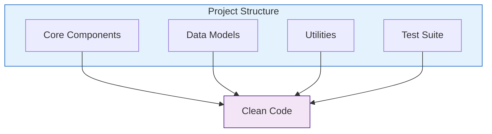
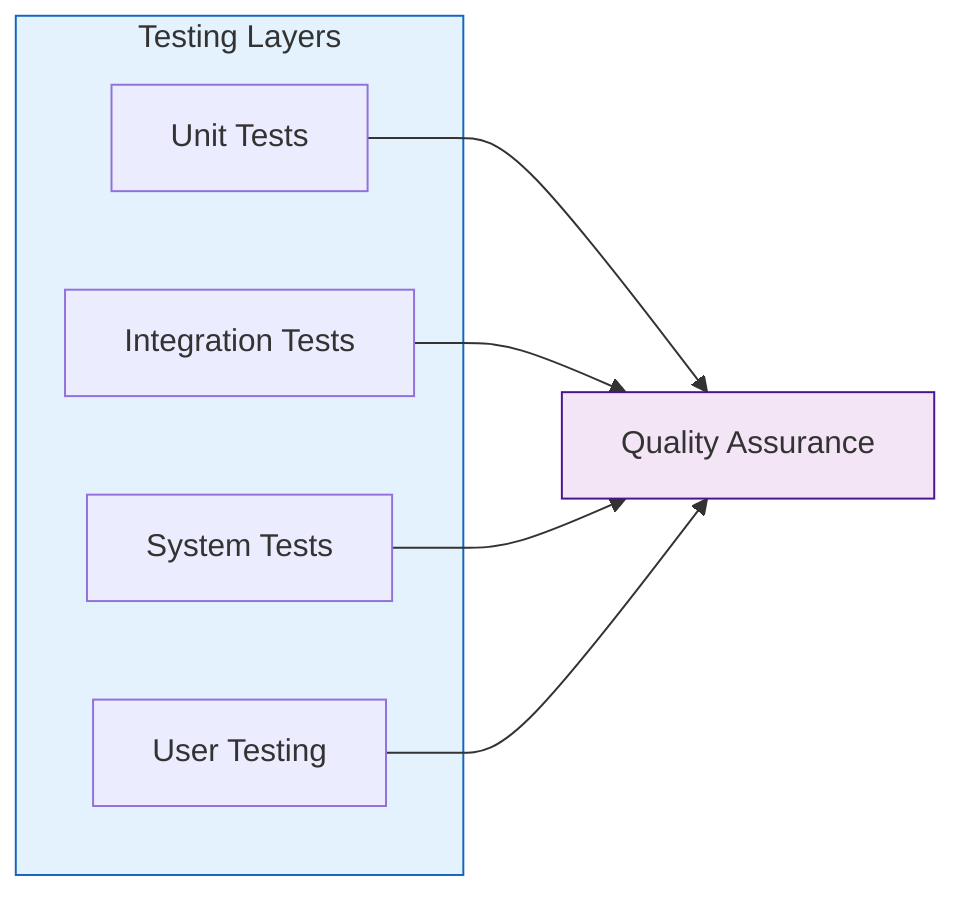
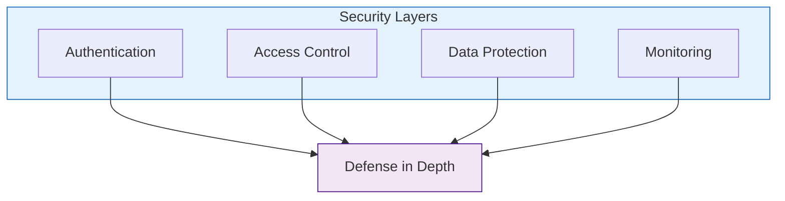

# Best Practices Guide

## 🎯 Development Best Practices

### Code Organization

1. **Directory Structure**
   - Keep core AI components in `src/core/`
   - Place data models in `src/models/`
   - Store utilities in `src/utils/`
   - Maintain tests in `tests/`

2. **Code Style**
   - Follow PEP 8 guidelines
   - Use meaningful variable names
   - Write comprehensive docstrings
   - Keep functions focused and small

3. **Version Control**
   - Make atomic commits
   - Write descriptive commit messages
   - Use feature branches
   - Review code before merging

## 🔄 LLM Integration

### Model Usage
1. **Prompt Engineering**
   - Keep prompts clear and specific
   - Include relevant context
   - Use consistent formatting
   - Handle edge cases

2. **Performance Optimization**
   - Cache common responses
   - Batch similar requests
   - Use appropriate context windows
   - Monitor token usage

3. **Error Handling**
   - Implement graceful fallbacks
   - Log model errors
   - Provide user feedback
   - Monitor failure rates

## 🎓 Educational Practices

### Teaching Scenarios
1. **Content Design**
   - Age-appropriate scenarios
   - Clear learning objectives
   - Progressive difficulty
   - Diverse teaching situations

2. **Feedback Generation**
   - Constructive criticism
   - Specific examples
   - Action-oriented suggestions
   - Positive reinforcement

3. **Student Simulation**
   - Realistic behaviors
   - Consistent personalities
   - Age-appropriate responses
   - Varied learning styles

## 🔍 Quality Assurance

### Testing Strategy

1. **Unit Testing**
   - Test individual components
   - Mock external dependencies
   - Cover edge cases
   - Maintain high coverage

2. **Integration Testing**
   - Test component interactions
   - Verify data flow
   - Check error handling
   - Test API endpoints

3. **System Testing**
   - End-to-end scenarios
   - Performance testing
   - Load testing
   - Security testing

## 📊 Monitoring and Maintenance

### System Health
1. **Performance Monitoring**
   - Track response times
   - Monitor resource usage
   - Log error rates
   - Analyze user patterns

2. **Data Management**
   - Regular backups
   - Data validation
   - Privacy protection
   - Clean old data

3. **System Updates**
   - Regular dependency updates
   - Security patches
   - Model updates
   - Feature improvements

## 🔒 Security Practices

### Security Measures

1. **Authentication & Authorization**
   - Implement strong authentication
   - Role-based access control
   - Session management
   - API security

2. **Data Protection**
   - Encrypt sensitive data
   - Secure data transmission
   - Regular security audits
   - Privacy compliance

3. **System Security**
   - Firewall configuration
   - Rate limiting
   - DDoS protection
   - Regular updates

## 📝 Documentation

### Documentation Standards
1. **Code Documentation**
   - Clear function descriptions
   - Parameter documentation
   - Return value descriptions
   - Usage examples

2. **API Documentation**
   - Endpoint descriptions
   - Request/response formats
   - Authentication details
   - Error responses

3. **User Documentation**
   - Installation guide
   - Configuration guide
   - Usage examples
   - Troubleshooting guide

## 🤝 Contributing Guidelines

### Development Process
1. **Feature Development**
   - Create feature branch
   - Follow coding standards
   - Write tests
   - Update documentation

2. **Code Review**
   - Review requirements
   - Check code quality
   - Verify tests
   - Validate documentation

3. **Release Process**
   - Version control
   - Change documentation
   - Release notes
   - Deployment checklist 