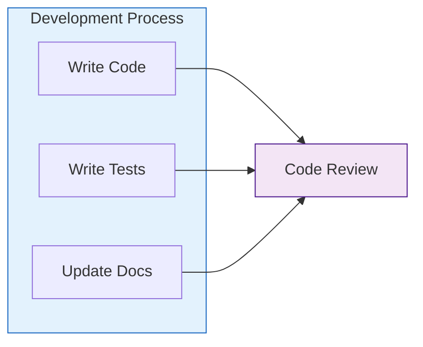
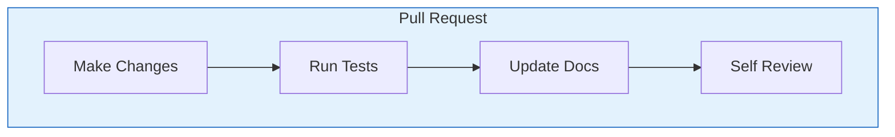

# Contributing to UTTA

## 👋 Welcome

Thank you for considering contributing to the Utah Elementary Teacher Training Assistant (UTTA)! This guide will help you understand our development process and how you can contribute effectively.

## 🚀 Getting Started

### Development Setup
```bash
# Fork and clone the repository
git clone https://github.com/your-username/UTTA.git
cd UTTA

# Create virtual environment
python -m venv venv
source venv/bin/activate  # Linux/macOS
# or
.\venv\Scripts\activate  # Windows

# Install dependencies
pip install -r requirements.txt

# Install development dependencies
pip install -r requirements-dev.txt
```

### Project Structure
```
UTTA/
├── src/
│   ├── core/          # Core AI components
│   ├── models/        # Data models
│   ├── interfaces/    # User interfaces
│   └── utils/         # Utilities
├── tests/             # Test suite
├── docs/              # Documentation
└── resources/         # Project resources
```

## 🔄 Development Workflow

### 1. Create a Branch
```bash
# Create a new branch for your feature
git checkout -b feature/your-feature-name

# For bug fixes
git checkout -b fix/bug-description
```

### 2. Make Changes


### 3. Testing
```bash
# Run tests
pytest tests/

# Run with coverage
pytest --cov=src tests/

# Run specific test
pytest tests/test_specific.py
```

### 4. Documentation
- Update relevant documentation
- Add docstrings to new code
- Update README if needed
- Add examples for new features

## 📝 Pull Request Process

### 1. Prepare Changes


### 2. Submit PR
- Create detailed PR description
- Link related issues
- Add test results
- Include screenshots if relevant

### 3. Review Process
- Address review comments
- Update tests if needed
- Keep PR focused
- Maintain clean commits

## 🧪 Testing Guidelines

### Test Structure
```python
# Example test structure
def test_feature():
    """Test feature functionality."""
    # Setup
    agent = TeacherTrainingAgent()
    scenario = create_test_scenario()
    
    # Execute
    result = agent.evaluate_teaching_response(
        "test response",
        scenario
    )
    
    # Assert
    assert result["effectiveness"] >= 0.0
    assert result["effectiveness"] <= 1.0
    assert "strengths" in result
    assert "suggestions" in result
```

### Test Coverage
- Unit tests for all new code
- Integration tests for features
- Edge case testing
- Performance testing

## 📚 Documentation Guidelines

### Code Documentation
```python
def process_response(
    response: str,
    context: Dict[str, Any]
) -> Dict[str, Any]:
    """
    Process teacher's response in given context.
    
    Args:
        response: Teacher's response text
        context: Current teaching context
        
    Returns:
        Dictionary containing:
        - effectiveness: Float between 0 and 1
        - feedback: List of feedback points
        - suggestions: List of improvements
        
    Example:
        result = process_response(
            "Let's try using visual aids",
            {"subject": "math", "grade": "2nd"}
        )
    """
    # Implementation
```

### Wiki Documentation
- Clear explanations
- Code examples
- Visual diagrams
- Use cases

## 🎯 Style Guide

### Python Style
- Follow PEP 8
- Use type hints
- Write clear docstrings
- Keep functions focused

### Git Commit Style
```
type(scope): description

- feat: New feature
- fix: Bug fix
- docs: Documentation
- test: Adding tests
- refactor: Code refactoring
```

## 🤝 Code of Conduct

### Community Guidelines
1. **Be Respectful**
   - Value diverse opinions
   - Use inclusive language
   - Be constructive

2. **Be Professional**
   - Stay on topic
   - Write clear messages
   - Follow guidelines

3. **Be Collaborative**
   - Help others learn
   - Share knowledge
   - Give credit

## 🏷️ Issue Labels

### Label Categories
1. **Type**
   - `feature`: New functionality
   - `bug`: Something isn't working
   - `docs`: Documentation only
   - `test`: Test-related changes

2. **Priority**
   - `critical`: Needs immediate attention
   - `high`: Important but not urgent
   - `medium`: Normal priority
   - `low`: Nice to have

3. **Status**
   - `in progress`: Being worked on
   - `review needed`: Ready for review
   - `blocked`: Waiting for something
   - `help wanted`: Need assistance 