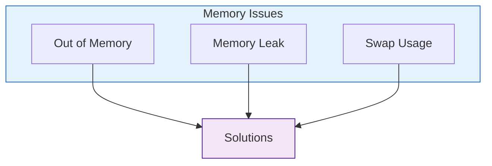
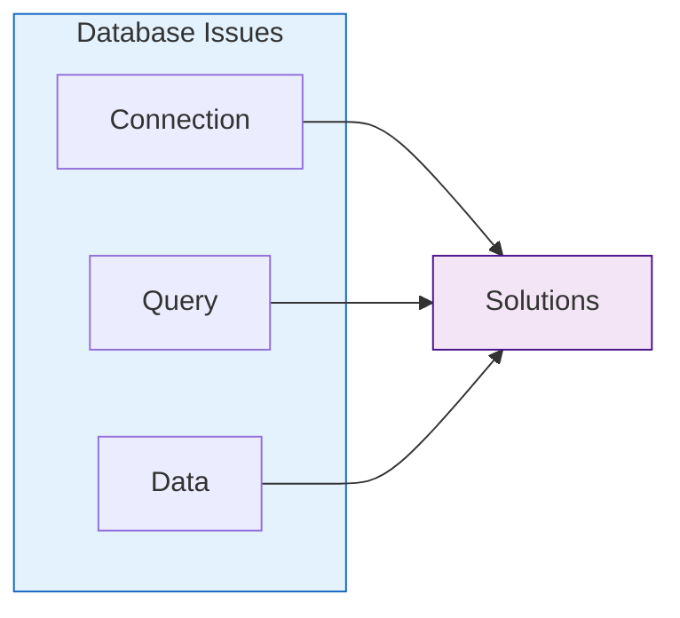

# Troubleshooting Guide

## 🔍 Common Issues and Solutions

### Installation Issues

#### LLM Model Installation
```bash
# Error: Failed to download model
ollama pull mistral

# Solution: Check network and retry
ollama pull mistral --verbose
```

**Common Problems:**
1. **Network Issues**
   - Check internet connection
   - Verify proxy settings
   - Try alternative download location

2. **Storage Issues**
   - Ensure sufficient disk space
   - Clean model cache
   - Check permissions

3. **GPU Issues**
   - Verify CUDA installation
   - Update GPU drivers
   - Check GPU compatibility

### Runtime Issues

#### Memory Management


1. **Out of Memory Errors**
   - Reduce batch size
   - Enable model quantization
   - Increase swap space
   - Use smaller models

2. **Memory Leaks**
   - Monitor memory usage
   - Check resource cleanup
   - Implement garbage collection
   - Profile memory usage

3. **Performance Issues**
   - Monitor CPU/GPU usage
   - Check process priority
   - Optimize model settings
   - Use performance profiling

### LLM Issues

#### Model Behavior
```python
# Example: Model Response Debugging
def debug_model_response(prompt: str):
    """Debug model response generation."""
    try:
        # Check tokenization
        tokens = tokenizer.encode(prompt)
        print(f"Token count: {len(tokens)}")
        
        # Generate with debugging
        response = model.generate(
            prompt,
            temperature=0.3,  # Lower for debugging
            max_tokens=100,
            echo=True  # Show prompt processing
        )
        
        return response
    except Exception as e:
        print(f"Error: {str(e)}")
        return None
```

1. **Poor Response Quality**
   - Check prompt formatting
   - Adjust temperature setting
   - Verify context window
   - Review model parameters

2. **Slow Response Times**
   - Monitor inference time
   - Check batch processing
   - Optimize context length
   - Use response caching

3. **Inconsistent Behavior**
   - Validate input data
   - Check model state
   - Review randomization
   - Log model outputs

### Database Issues

#### Knowledge Base


1. **Connection Issues**
   - Check database status
   - Verify credentials
   - Test network connection
   - Review connection pool

2. **Query Performance**
   - Optimize queries
   - Check indexes
   - Monitor query time
   - Use query caching

3. **Data Integrity**
   - Validate data format
   - Check constraints
   - Review transactions
   - Backup regularly

### API Issues

#### Endpoint Problems
```yaml
# Common API Issues
endpoints:
  /scenarios:
    GET:
      issues:
        - Timeout
        - Rate limiting
        - Authentication
    POST:
      issues:
        - Validation
        - Payload size
        - Processing errors
```

1. **Authentication**
   - Check API keys
   - Verify tokens
   - Review permissions
   - Monitor auth logs

2. **Rate Limiting**
   - Implement retries
   - Use backoff strategy
   - Monitor usage
   - Cache responses

3. **Response Errors**
   - Log error details
   - Handle status codes
   - Validate responses
   - Implement fallbacks

## 🛠️ Debugging Tools

### Logging
```python
# Example: Enhanced Logging
import logging

logging.basicConfig(
    level=logging.DEBUG,
    format='%(asctime)s - %(name)s - %(levelname)s - %(message)s',
    handlers=[
        logging.FileHandler('debug.log'),
        logging.StreamHandler()
    ]
)

def debug_session():
    """Debug current session state."""
    logging.info("Starting debug session")
    
    # Check components
    logging.debug("Checking LLM status")
    check_llm_status()
    
    logging.debug("Verifying database connection")
    check_database()
    
    logging.debug("Testing API endpoints")
    test_endpoints()
```

### Monitoring
1. **System Metrics**
   - CPU/Memory usage
   - Disk I/O
   - Network traffic
   - GPU utilization

2. **Application Metrics**
   - Response times
   - Error rates
   - Request volume
   - Cache hits/misses

3. **Model Metrics**
   - Inference time
   - Token usage
   - Model accuracy
   - Memory consumption

## 🚨 Error Recovery

### Recovery Procedures
1. **System Crashes**
   - Check error logs
   - Restore from backup
   - Verify data integrity
   - Update monitoring

2. **Data Corruption**
   - Stop affected services
   - Backup corrupt data
   - Restore clean backup
   - Verify restoration

3. **Service Outages**
   - Identify root cause
   - Implement fixes
   - Test restoration
   - Update documentation

## 📋 Maintenance Checklist

### Regular Maintenance
1. **Daily Tasks**
   - Check error logs
   - Monitor performance
   - Verify backups
   - Clean temp files

2. **Weekly Tasks**
   - Review metrics
   - Update dependencies
   - Test recovery
   - Clean caches

3. **Monthly Tasks**
   - Security updates
   - Performance review
   - Capacity planning
   - Documentation updates 